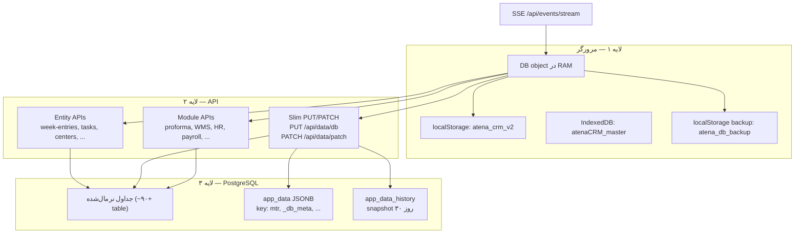
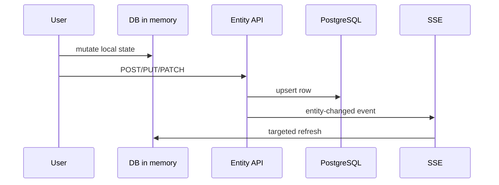

# نقشه کامل ذخیره‌سازی داده — Click CRM

> **آخرین به‌روزرسانی:** ۱۴۰۴/۰۴/۲۴ (ژوئیه ۲۰۲۶)  
> **مخاطب:** تیم توسعه، DevOps، مدیر محصول  
> **هدف:** مرجع واحد برای معماری دیتابیس، مسیرهای save، وضعیت migration و roadmap

---

## فهرست

1. [معماری کلی](#۱-معماری-کلی)
2. [شیء DB در فرانت‌اند](#۲-شیء-db-در-فرانت‌اند)
3. [مکانیزم‌های ذخیره در core.js](#۳-مکانیزم‌های-ذخیره-در-corejs)
4. [PostgreSQL — جداول به تفکیک دامنه](#۴-postgresql--جداول-به-تفکیک-دامنه)
5. [نقشه فیچر → API → جدول](#۵-نقشه-فیچر--api--جدول)
6. [APIهای نوشتن (server/routes)](#۶-apiهای-نوشتن-serverroutes)
7. [همگام‌سازی زنده (SSE)](#۷-همگام‌سازی-زنده-sse)
8. [Conflict 409 و merge](#۸-conflict-409-و-merge)
9. [سیستم Backup و بازیابی](#۹-سیستم-backup-و-بازیابی)
10. [ماتریس وضعیت migration](#۱۰-ماتریس-وضعیت-migration)
11. [Root Cause «پریدن داده»](#۱۱-root-cause-پریدن-داده)
12. [نقشه راه (Roadmap)](#۱۲-نقشه-راه-roadmap)
13. [اصول توسعه جدید](#۱۳-اصول-توسعه-جدید)
14. [Runbook سریع](#۱۴-runbook-سریع)
15. [فایل‌های مرجع](#۱۵-فایل‌های-مرجع)

---

## ۱. معماری کلی

### سه لایه

```
┌─────────────────────────────────────────────────────────────┐
│  لایه ۱ — مرورگر                                            │
│  DB object (RAM) + localStorage + IndexedDB + backup محلی    │
└──────────────────────────┬──────────────────────────────────┘
                           │
┌──────────────────────────▼──────────────────────────────────┐
│  لایه ۲ — Express API                                       │
│  Entity APIs  |  Slim PUT/PATCH  |  Module APIs (REST)      │
└──────────────────────────┬──────────────────────────────────┘
                           │
┌──────────────────────────▼──────────────────────────────────┐
│  لایه ۳ — PostgreSQL (~۹۰+ جدول)                            │
│  جداول نرمال  |  app_data JSONB  |  app_data_history       │
└─────────────────────────────────────────────────────────────┘
```

### دیاگرام جریان



### اصل طراحی (بعد از refactor)

```
یک entity → یک API → یک row SQL
(بدون dual-write برای همان entity)
```

**Dual-write** (API + `saveDB()` همزمان) علت اصلی گزارش «تغییر دادم ولی پرید» بود.

---

## ۲. شیء DB در فرانت‌اند

همه تب‌ها روی یک آبجکت global به نام `DB` کار می‌کنند.

### بارگذاری اولیه (`init()`)

| مرحله | تابع | API |
|-------|------|-----|
| 1 | `loadDB()` | `GET /api/data/db` (+ fallback localStorage) |
| 2 | `loadWeekEntriesFromSQL()` | `GET /api/week-entries` |
| 3 | `loadTasksFromSQL()` | `GET /api/tasks` |
| 4 | `loadMasterCenters()` | `GET /api/data/centers/master` → IndexedDB |

### ساختار اصلی `DB`

| فیلد | شکل | معنی |
|------|-----|------|
| `edits` | `{center_key: {status, owner, followupDate, ...}}` | قلب CRM — override هر مرکز |
| `notes` | `{center_key: [note,...]}` | یادداشت‌های مرکز |
| `weekEntries` | `{weekId:::rtype:::rid: {...}}` | برنامه هفته |
| `tasks` | `[{id, title, status, subtasks[], ...}]` | کانبان وظایف |
| `changeLog` | `[{at, by, rkey, field, val}]` | تاریخچه تغییر فیلد |
| `notifications` | `[{id, to, msg, read, ...}]` | زنگ اعلان |
| `tags` / `rTags` | global tags + per-center tag ids | برچسب‌ها |
| `events` | array | تقویم |
| `checklist` | `{date_userId: {items, note}}` | چک‌لیست روزانه |
| `callLog`, `visitLog`, `salesLog`, `missionLog` | arrays | KPI / فعالیت |
| `kpiTargets`, `kpiHistory` | targets + snapshots | KPI |
| `settings` | members, taskColumns, lists, ... | تنظیمات |
| `extra` | user-added centers | مراکز اضافه‌شده |
| `provHistory` | province ownership changes | تاریخچه استان |
| `_mtr` | receivables blob | مطالبات (Excel) |

### کلید مرکز (center key)

- تهران: `center_{id}` — type = `'center'`
- استان‌ها: `pc_{provId}||{n}` — type = `'pc'`

### خواندن/نوشتن مرکز

```javascript
getE(type, id)                    // خواندن فیلد
setE(type, id, field, val)        // نوشتن → PATCH /api/centers/:key + changeLog
patchCenterField(centerKey, ...)  // PATCH مستقیم
postCenterNote(centerKey, text)   // یادداشت → SQL
```

### زنجیره resolve مسئول (owner)

1. `getE(rtype,id).owner`
2. static center `owner` (CENTERS / `_PC_CACHE`)
3. `DB.extra[].owner`
4. `we.addedBy` (فقط week entries)

پیاده‌سازی canonical: `_wpGetOwner(we)` در `weekplan.js`

---

## ۳. مکانیزم‌های ذخیره در core.js

| تابع | تاخیر | API | کاربرد |
|------|-------|-----|--------|
| `saveDB()` | debounce 600ms | `PUT /api/data/db` | slim payload باقیمانده |
| `saveDBSync(fullSync)` | فوری | `PUT /api/data/db` | save فوری |
| `saveDBFull()` | فوری | `PUT` + `_fullSync:true` | import/restore کامل |
| `savePatchDB(fragment)` | queue 400ms | `PATCH /api/data/patch` | patch جزئی |
| `patchCenterField()` | فوری | `PATCH /api/centers/:key` | یک فیلد مرکز |
| `postCenterNote()` | فوری | `POST /api/centers/:key/notes` | یادداشت |
| `saveWeekEntryApi()` و helpers | فوری | `/api/week-entries/*` | برنامه هفته |
| `postActivityLog()` | فوری | `POST /api/activity-log` | تماس/ویزیت/فروش |
| `deleteActivityLog()` | فوری | `DELETE /api/activity-log/:type/:id` | حذف لاگ |
| `postMissionLog()` | فوری | `POST /api/mission-log` | ماموریت |
| `postKpiSnapshot()` | فوری | `POST /api/kpi-data/history` | snapshot KPI |
| `postProvHistory()` | فوری | `POST /api/prov-history` | تاریخچه استان |
| `saveGlobalTagsApi()` | فوری | `PUT /api/tags` | برچسب‌های global |
| `saveCenterTagsApi()` | فوری | `PATCH /api/tags/centers/:key` | برچسب مرکز |
| `saveCenterExtraApi()` | فوری | `POST /api/center-extras` | مرکز اضافه |
| `patchCrmSetting()` | فوری | `PATCH /api/crm-settings/:key` | یک کلید تنظیمات |

### Slim PUT — `_buildSavePayload(false)`

**شامل می‌شود:**

```
settings, kpiTargets, provOverrides,
events, checklist,
callLog, visitLog, salesLog, missionLog,
provHistory, kpiHistory, extra, _mtr
```

**عمداً حذف شده** (فقط از API entity):

```
edits, notes, tags, rTags, weekEntries, tasks, notifications, changeLog
```

اگر slim payload خالی باشد، `_saveDBNow` اصلاً درخواست نمی‌زند.

### Full Sync (`_fullSync: true`)

- کل `DB` clone + `_fullSync:true`
- سرور DELETE+INSERT برای: events, checklist, logs, kpi targets, extras
- فقط برای: import, restore, purge — **نه save روزمره**

### Backup محلی قبل از هر save

```
localStorage:
  atena_db_backup      — snapshot قبل از save
  atena_db_last_synced — آخرین state همگام
  atena_db_synced      — 'true' | 'false'
```

اگر save fail شود، در load بعدی `mergeDatabaseDiff` اجرا می‌شود.

---

## ۴. PostgreSQL — جداول به تفکیک دامنه

### ۴.۱ CRM هسته

| جدول | محتوا |
|------|-------|
| `center_edits` | `DB.edits` — status, owner, followup, competitor, oppValue, ... |
| `center_notes` | یادداشت‌های مرکز (JSONB array) |
| `center_tags` | tag ids هر مرکز |
| `center_extras` | مراکز اضافه‌شده (`DB.extra`) |
| `centers_master` | لیست master مراکز (`CENTERS`, `PC_RAW`) |
| `change_log` | `DB.changeLog` |
| `center_deals` | فرصت‌ها / deals |
| `center_files` | فایل‌های مرکز (metadata) |
| `center_pricing_config` | tier قیمت مرکز |
| `center_audit` | audit pricing/contacts |
| `center_contacts` | legacy single contact |
| `deleted_entities` | soft-delete tombstones |
| `distribution_proposals` | پیشنهاد توزیع استان |

### ۴.۲ برنامه هفته، وظایف، اعلان

| جدول | محتوا |
|------|-------|
| `week_entries` | برنامه هفته — **source of truth** |
| `tasks` | وظایف کانبان + subtasks JSONB |
| `notifications` | اعلان‌های زنگ |
| `manager_tasks` | follow-upهای مدیر |
| `manager_weekly_snapshots` | snapshot گزارش هفتگی |

### ۴.۳ تقویم، چک‌لیست، KPI

| جدول | محتوا |
|------|-------|
| `app_events` | رویداد تقویم |
| `daily_checklists` | چک‌لیست روزانه `(date, username)` |
| `call_log` | تماس‌های KPI |
| `visit_log` | ویزیت‌های KPI |
| `sales_log` | فروش KPI |
| `mission_log` | ماموریت ماهانه |
| `kpi_user_targets` | اهداف KPI per-user/month |
| `kpi_province_targets` | اهداف KPI per-province |
| `kpi_history` | snapshot ماهانه KPI |
| `province_history` | تاریخچه تغییر مسئول استان |

### ۴.۴ HCP / KOL

| جدول | محتوا |
|------|-------|
| `healthcare_professionals` | پزشک/KOL |
| `hcp_affiliations` | many-to-many با مراکز |

### ۴.۵ قیمت‌گذاری / Proforma / فاکتور

| جدول | محتوا |
|------|-------|
| `products` | کاتالوگ محصول |
| `price_lists` / `price_list_items` | لیست قیمت |
| `commission_rules` | قوانین کمیسیون |
| `price_quotes` / `price_quote_items` | پیش‌فاکتور قیمت |
| `product_files` | فایل محصول |
| `proformas` | پروفرما (zod validated) |
| `proforma_files` | پیوست پروفرما |
| `proforma_events` | timeline workflow پروفرما |
| `invoices` / `invoice_payments` | فاکتور صادرشده |

### ۴.۶ WMS (انبار — `/wms`)

| جدول | محتوا |
|------|-------|
| `wms_products` | کاتالوگ |
| `wms_warehouses` | انبارها |
| `wms_counterparties` | تامین‌کننده/مشتری |
| `wms_lots` | batch/lot |
| `wms_transactions` | ورود/خروج |
| `wms_purchase_orders` | سفارش خرید (items JSONB) |
| `wms_recalls` | recall محصول |
| `wms_fiscal_years` | سال مالی جلالی |
| `wms_opening_balances` | موجودی اول دوره |
| `wms_audit_log` | audit immutable |
| `wms_settings` | config key-value |

### ۴.۷ Workflows

| جدول | محتوا |
|------|-------|
| `workflow_definitions` | تعریف فرآیند (stages, transitions) |
| `workflow_instances` | instance در حال اجرا |
| `workflow_transitions` | تاریخچه transition |

### ۴.۸ MTR / Faradis (مطالبات)

| جدول/Store | محتوا |
|------------|-------|
| `app_data` key `'mtr'` | کل blob مطالبات (Excel upload) |
| `mtr_invoice_meta` | meta per-invoice (یادداشت، followup) |
| `faradis_*_cache` | cache داده Faradis |
| `center_faradis_link` | matching CRM ↔ accounting |
| `center_faradis_rejected` | رد شده‌ها |
| `faradis_marketer_map` | mapping بازاریاب |
| `faradis_sync_log` | log sync |
| `sync_*` tables | external sync receiver |

### ۴.۹ HR / Payroll / Trade

| جدول | محتوا |
|------|-------|
| `employees` | پرسنل |
| `leave_requests` / `leave_balance` | مرخصی |
| `employee_contracts` | قرارداد |
| `payroll_records` | دوره حقوق |
| `payroll_monthly_variables` | متغیرهای ماهانه |
| `payroll_workflow_log` | workflow تایید حقوق |
| `tax_brackets` | پلکان مالیاتی |
| `commission_settings` | تنظیمات کمیسیون |
| `attendance_logs` | حضور و غیاب |
| `disciplinary_actions` | اقدامات انضباطی |
| `employee_documents` | مدارک پرسنلی |
| `public_holidays` | تعطیلات |
| `approval_delegations` | تفویض تایید |
| `hr_settings` | تنظیمات HR |
| `trade_tasks` / `trade_kpi_*` | KPI بازرگانی |
| `trade_cases` / `trade_case_activities` | پرونده بازرگانی |
| `trade_process_templates` | قالب فرآیند |
| `trade_daily_reports` / `trade_clearances` / ... | گزارش‌ها |
| `support_tickets` / `ticket_comments` | تیکت پشتیبانی |

### ۴.۱۰ نامه / Inbox / Discovery / سایر

| جدول | محتوا |
|------|-------|
| `letters` + `letter_*` | مکاتبات |
| `inbox_items` | inbox یکپارچه |
| `discovered_centers` | کشف مراکز biopsy |
| `mission_files` | فایل ماموریت |
| `sales_targets` | اهداف فروش |
| `bot_sessions` | Telegram bot |

### ۴.۱۱ Auth / Settings / Blob legacy

| جدول | محتوا |
|------|-------|
| `app_users` | کاربران (source of truth برای members) |
| `app_settings` | تنظیمات key-value (taskColumns, tagDefinitions, kpi_weights, ...) |
| `app_data` | KV legacy: `_db_meta`, `mtr`, ... |
| `app_data_history` | snapshot ۳۰ روزه هر PUT |
| `scheduled_backups` | log backup خودکار |
| `schema_migrations` | migration runner |

---

## ۵. نقشه فیچر → API → جدول

### تب‌های اصلی CRM

| تب / فیچر | Store اصلی | API نوشتن | فایل JS | وضعیت |
|-----------|------------|-----------|---------|-------|
| **استان‌ها / مراکز** | `center_edits`, `center_notes`, `center_tags` | `PATCH /api/centers/:key`, `POST .../notes`, `PATCH /api/tags/centers/:key` | `settings.js`, `provinces.js` | ✅ SQL-primary |
| **برنامه هفته** | `week_entries` | `/api/week-entries` (POST/PUT/DELETE/bulk-*) | `weekplan.js`, `core.js` | ✅ SQL-only |
| **وظایف** | `tasks` | `/api/tasks` CRUD | `tasks.js` | ✅ SQL-only |
| **تقویم** | `app_events` | `savePatchDB({events})` یا `POST /api/calendar-events` | `calendar.js` | 🟡 SQL via patch |
| **چک‌لیست** | `daily_checklists` | `savePatchDB({checklist})` یا `POST /api/checklist` | `checklist.js` | 🟡 SQL via patch |
| **KPI / فعالیت** | `call_log`, `visit_log`, `sales_log`, `mission_log` | `/api/activity-log`, `/api/mission-log`, `/api/kpi-data/history` | `manager-tasks.js`, `kpi.js` | 🟢 API + safety net |
| **KPI targets** | `kpi_*`, `app_settings` | `POST /api/kpi-data/*` + slim PUT | `kpi.js` | 🟡 dual-path |
| **مدیر** | reads + snapshots | `/api/manager-reports/*`, `/api/manager-followups/*` | `manager.js` | 🟡 برخی saveDB باقی |
| **لاگ تغییرات** | `change_log` | `POST /api/changelog` | `settings.js`, `weekplan.js` | ✅ SQL-only write |
| **اعلان‌ها** | `notifications` | `POST/PUT /api/notifications` | `weekplan.js` | ✅ SQL-only (+ fallback) |
| **مطالبات MTR** | `app_data.mtr` + Faradis | `PUT /api/data/mtr`, `POST /api/mtr/sync` | `mtr.js` | 🔵 blob-by-design |
| **قیمت‌گذاری** | `products`, `price_*`, ... | `/api/pricing/*` | `pricing.js` | ✅ SQL (+ برخی saveDB) |
| **Proforma** | `proformas` | `/api/proforma/*` | `proforma.js` | ✅ SQL-only |
| **Workflows** | `workflow_*` | `/api/workflows/*` | `workflows.js` | ✅ SQL-only |
| **HCP/KOL** | `healthcare_professionals` | `/api/hcps/*` | `hcp.js` | ✅ SQL-only |
| **HR** | `employees`, leave, ... | `/api/hr/*` | `hr.js` | ✅ SQL-only |
| **Payroll** | `payroll_records`, ... | `/api/payroll/*` | `payroll.js` | ✅ SQL-only |
| **Trade** | `trade_*` | `/api/trade-kpi/*`, `/api/trade-cases/*` | trade modules | ✅ SQL-only |
| **WMS** | `wms_*` | `/api/wms/*`, `/api/wms-ext/*` | `wms.html`, `wms*.js` | ✅ SQL-only |
| **Letters** | `letters`, `letter_*` | `/api/letters/*` | letters module | ✅ SQL-only |
| **Discovery** | `discovered_centers` | `/api/discovery/*` | KPI tab | ✅ SQL-only |
| **Inbox** | `inbox_items` | `/api/inbox/*` | header widget | ✅ SQL-only |
| **Settings / Users** | `app_users`, `app_settings` | `/api/users/*`, `/api/settings/*` | `settings.js` | ✅ SQL |
| **Backup / Data Hub** | snapshots | `/api/backups/*`, `/api/data/history/*` | `backup.js` | ✅ SQL |

### فیچرهای modal / جزئی

| فیچر | API | جدول |
|------|-----|------|
| Done modal (weekplan) | week-entry PUT + changelog + center note | `week_entries`, `change_log`, `center_notes` |
| Pre-call brief / quick log | `setE` + note | `center_edits`, `center_notes` |
| Center deals | `/api/center-deals` | `center_deals` |
| Center files | `/api/center-files/upload` | `center_files` + filesystem |
| Convert followup → task | `/api/tasks` POST | `tasks` |
| Excel import centers | `/api/center-extras` | `center_extras` |
| Province owner change | `setE` + `/api/prov-history` | `center_edits`, `province_history` |
| Tag CRUD settings | `PUT /api/tags` | `app_settings.tagDefinitions` |
| Telegram bot | inline keyboard | `proformas`, notifications |
| Soft delete center | `/api/data/centers/soft-delete` | `deleted_entities` |
| Merge duplicate centers | `/api/data/centers/merge` | multiple tables |

---

## ۶. APIهای نوشتن (server/routes)

### مرکزی — `data.js`

| Method | Path | جداول |
|--------|------|-------|
| PUT | `/api/data/db` | همه normalized + `_mtr` + `_db_meta` + history |
| PATCH | `/api/data/patch` | partial upsert (بدون wipe) |
| PUT | `/api/data/mtr` | `app_data` key `mtr` |
| PUT | `/api/data/centers/master` | `centers_master` |
| POST | `/api/data/centers/soft-delete` | `deleted_entities` |
| POST | `/api/data/centers/merge` | merge duplicates |
| POST | `/api/data/history/:id/restore` | restore snapshot |
| POST | `/api/data/restore` | portable JSON restore |
| PUT | `/api/data/kv/:key` | arbitrary KV in `app_data` |

### Entity APIs (CRM core)

| Route file | Endpoints | جداول |
|------------|-----------|-------|
| `centers.js` | PATCH `/:key`, POST `/:key/notes`, DELETE notes | `center_edits`, `center_notes`, `change_log` |
| `week-entries.js` | POST, PUT, DELETE, bulk-* | `week_entries` |
| `tasks.js` | POST, PUT, DELETE, comment, done | `tasks` |
| `notifications.js` | POST, PUT read, DELETE | `notifications` |
| `changelog.js` | POST, DELETE cleanup | `change_log` |
| `tags.js` | PUT global, PATCH centers/:key | `app_settings`, `center_tags` |
| `crm-settings.js` | PATCH `/:key` | `app_settings` |
| `settings.js` | PUT, PATCH | `app_settings` |
| `activity-log.js` | POST, DELETE | `call_log`, `visit_log`, `sales_log` |
| `mission-log.js` | POST, DELETE | `mission_log` |
| `kpi-data.js` | POST history, targets | `kpi_*` |
| `prov-history.js` | POST, DELETE | `province_history` |
| `calendar-events.js` | POST, DELETE | `app_events` |
| `checklist-api.js` | POST | `daily_checklists` |
| `center-extras.js` | POST, DELETE | `center_extras` |
| `center-deals.js` | POST, PUT, DELETE | `center_deals` |
| `center-files.js` | POST upload, DELETE | `center_files` |

### Module APIs (مستقل)

| Domain | Route prefix | SQL-only |
|--------|-------------|----------|
| Proforma | `/api/proforma` | ✅ |
| WMS | `/api/wms`, `/api/wms-ext` | ✅ |
| Workflows | `/api/workflows` | ✅ |
| HR | `/api/hr` | ✅ |
| Payroll | `/api/payroll` | ✅ |
| Trade | `/api/trade-kpi`, `/api/trade-cases` | ✅ |
| Letters | `/api/letters` | ✅ |
| Pricing | `/api/pricing` | ✅ |
| MTR/Faradis | `/api/mtr`, `/api/mtr-sync`, `/api/faradis*` | mixed |
| Backups | `/api/backups` | triggers pg_dump |

### Safety net سرور — `server/lib/blob-partial-save.js`

برای slim PUT/PATCH (بدون `_fullSync`)، این collectionها **UPSERT** می‌شوند (نه DELETE ALL):

```
events, callLog, visitLog, salesLog, missionLog, kpiHistory, extra
```

---

## ۷. همگام‌سازی زنده (SSE)

**اتصال:** `EventSource('/api/events/stream?cid=' + tabId)`

هر tab یک `_sseClientId` دارد تا event خودش را ignore کند.

| Event | منبع | رفتار کلاینت |
|-------|------|--------------|
| `db-updated` | PUT/PATCH blob | fetch `/api/data/db` → `mergeDatabaseDiff` → re-render |
| `week-entry-changed` | week-entries API | refresh هدفمند weekplan |
| `notif_new` | notifications | refresh bell + toast |
| `center-changed` | PATCH center | merge center |
| `letter-changed` | letters | refresh letters |
| `trade-case-changed` | trade cases | refresh trade UI |
| `mtr-updated` | PUT mtr | refresh MTR panel |
| `app-reload` | manager POST `/api/events/reload` | full page reload |
| `connected` / heartbeat | keepalive | ignored |

---

## ۸. Conflict 409 و merge

### مکانیزم

1. سرور `_db_meta` در `app_data` نگه می‌دارد: `{cid, updated_at, updated_by}`
2. کلاینت `_clientTs` (آخرین server timestamp) + header `X-Cid` می‌فرستد
3. **409** اگر: `serverTs !== _clientTs` **و** (user متفاوت **یا** tab/client متفاوت)
4. کلاینت: fetch تازه → `mergeDatabaseDiff(local, server, _lastSyncedDB)` → retry PUT یک‌بار
5. same-user same-tab → 409 نمی‌دهد (save سریع پشت‌سرهم OK)

### mergeDatabaseDiff

- `edits`: per-key field merge با `_ts`
- `notes`: merge arrays
- `weekEntries`: **دیگر در blob نیست** — از SQL load
- `tasks`, `notifications`: از SQL load

### محدودیت

Conflict روی **کل DB timestamp** است، نه per-entity. دو کاربر روی دو مرکز مختلف هم ممکن است 409 بگیرند.

---

## ۹. سیستم Backup و بازیابی

| لایه | مکانیزم | مسیر / جدول |
|------|---------|-------------|
| Scheduled pg_dump | ۳× روز (۱۱، ۱۳، ۱۸ تهران) | `~/db_backups/scheduled_*.sql.gz` |
| Retention | ۳۰ روز | `BACKUP_RETENTION_DAYS` env |
| In-DB snapshot | هر PUT `/api/data/db` | `app_data_history` (۳۰ روز) |
| Manual backup | Settings → Data Hub | `POST /api/backups/run` |
| Portable JSON | export/import | `GET/POST /api/data/backup`, `/api/data/restore` |
| History restore | manager-only | `POST /api/data/history/:id/restore` |
| Local client backup | قبل هر save | `localStorage atena_db_backup` |
| Deploy log | deploy script | `~/db_backups/deploy.log` |

### Restore سریع

```bash
# full backup
gunzip -c ~/db_backups/scheduled_TIMESTAMP.sql.gz | psql -U postgres atena_crm

# فقط app_data
gunzip -c ~/db_backups/appdata_TIMESTAMP.sql.gz | psql -U postgres atena_crm
```

### weekEntries guard (تاریخچه → وضعیت فعلی)

**قبلاً:** PUT با weekEntries کمتر → merge به‌جای overwrite.

**الان:** `weekEntries` در PUT/PATCH **کاملاً ignore** — فقط `/api/week-entries`.

---

## ۱۰. ماتریس وضعیت migration

### Legend

```
✅ SQL-only     = فقط API entity، blob ignore
✅ SQL-primary  = API اصلی، blob فقط import
🟢 API+safety   = API اصلی + slim PUT upsert (safety net)
🟡 Residual     = هنوز saveDB/savePatchDB در UI
🔵 Blob-design  = عمداً blob
```

| داده | وضعیت | مسیر نوشتن |
|------|-------|------------|
| `week_entries` | ✅ SQL-only | `/api/week-entries` |
| `tasks` | ✅ SQL-only | `/api/tasks` |
| `notifications` | ✅ SQL-only | `/api/notifications` |
| `change_log` | ✅ SQL-only (write) | `/api/changelog` |
| `center_edits` | ✅ SQL-primary | `PATCH /api/centers/:key` |
| `center_notes` | ✅ SQL-primary | `POST /api/centers/:key/notes` |
| `center_tags` | ✅ SQL-primary | `PATCH /api/tags/centers/:key` |
| `proformas` | ✅ SQL-only | `/api/proforma/*` |
| `wms_*` | ✅ SQL-only | `/api/wms/*` |
| `workflows` | ✅ SQL-only | `/api/workflows/*` |
| `hr_*`, `payroll_*` | ✅ SQL-only | `/api/hr/*`, `/api/payroll/*` |
| `letters` | ✅ SQL-only | `/api/letters/*` |
| `app_events` | 🟡 Residual | `savePatchDB` / slim PUT UPSERT |
| `daily_checklists` | 🟡 Residual | `savePatchDB` / slim PUT UPSERT |
| Activity logs | 🟢 API+safety | `/api/activity-log` + slim PUT |
| `kpiHistory` | 🟢 API+safety | `/api/kpi-data/history` + slim PUT |
| `settings` keys | 🟡 Migrating | `patchCrmSetting` + slim PUT |
| `_mtr` | 🔵 Blob-design | `PUT /api/data/mtr` |
| Full import | bulk | `saveDBFull()` → `_fullSync` |

### hotspotهای باقیمانده `saveDB()`

| فایل | موارد | وضعیت |
|------|-------|--------|
| `core.js` | `saveDB()`/`saveDBFull()` — infrastructure + residual slim PUT | ✅ عمدی |
| `backup.js` | import/restore → `saveDBFull()` | ✅ عمدی |
| `mtr.js` | blob مطالبات `PUT /api/data/mtr` | ✅ عمدی |

> همه ماژول‌های تب (weekplan, calendar, checklist, tasks, pricing, manager, proforma, …) از entity API استفاده می‌کنند.

### باقیمانده 🔲

| اولویت | کار | وضعیت |
|--------|-----|--------|
| P1 | calendar/checklist SQL-only | ✅ |
| P1 | pricing → `patchCrmSetting` | ✅ |
| P2 | حذف fallback saveDB در tasks/proforma | ✅ |
| P2 | MTR auto-sync (`mtrSyncEnabled` + polling) | ✅ |
| P3 | SSE per-entity (activity-log, center-changed) | ✅ |
| P3 | conflict per-center (`expectedTs`) | ✅ |
| P3 | `docs/SECURITY_ACCESS_MAP.md` | ✅ |
| P4 | deprecate slim PUT / `app_data` blob | 🔲 tech debt |
| P4 | MTR → SQL tables (نه blob) | 🔲 |
| P4 | Vue migration (`src/` → `public/dist/`) | 🔲 |
| P4 | conflict per-entity برای week_entries/tasks rows | 🔲 |

### علامت

کاربر تغییر می‌دهد → UI درست → بعد (refresh / SSE / tab دیگر) تغییر نیست.

### علت ریشه‌ای (قبل از refactor)

```
تغییر → DB در RAM → (شاید entity API) → همیشه saveDB() → PUT کل blob
```

| # | علت | محل |
|---|-----|-----|
| R1 | هر save = کل CRM در یک PUT | `core.js` → `_saveDBNow()` |
| R2 | Dual-write: API درست save، saveDB 600ms بعد overwrite | `weekplan.js` + `data.js` |
| R3 | PUT replace کامل vs API merge | `data.js` |
| R4 | bulk done/remove فقط saveDB | `weekplan.js` (✅ fixed) |
| R5 | merge ضعیف weekEntries | `mergeDatabaseDiff` (✅ fixed) |
| R6 | conflict 409 روی کل DB | `data.js` + `core.js` |

### راه‌حل اعمال‌شده

```
✅ یک entity → یک API → یک row SQL
✅ week_entries از blob حذف
✅ setE → PATCH center (نه saveDB)
✅ slim PUT فقط residual + UPSERT (نه DELETE ALL)
✅ safety net: blob-partial-save.js
```

---

## ۱۲. نقشه راه (Roadmap)

از `docs/IMPROVEMENT_PLAN.md`:

```
فاز ۱ Safety Net ──→ فاز ۲ Week Plan ──→ فاز ۲β Centers ──→ فاز ۲γ Tasks/Notif
        │                    ✅                  ✅                  ✅
        └────────────────────┴──────────────────┴──→ فاز ۳ Observability ✅
                                                    └──→ فاز ۴ Hardening (partial)
                                                         └──→ فاز ۵ Tech Debt
```

### انجام‌شده ✅

| فاز | کار |
|-----|-----|
| 2α | week plan SQL-only؛ bulk APIs؛ omit از blob |
| 2β | PATCH centers؛ setE → patch |
| 2γ | tasks/notifications SQL-only |
| 2δ | events/checklist UPSERT |
| 3 | logging، runbook، health check |
| اخیر | activity logs safety net + API wiring |

### باقیمانده 🔲

| اولویت | کار | هدف |
|--------|-----|-----|
| P4 | deprecate slim PUT / `app_data` blob | tech debt |
| P4 | MTR normalization به SQL | جایگزین blob |
| P4 | conflict per-row (week_entries, tasks) | دقت بیشتر |
| P4 | Vue migration (`src/` → `public/dist/`) | frontend modern |

### MTR Accounting Integration

- Route: `/api/mtr/sync` از Faradis — **✅ live**
- Toggle: `DB.settings.mtrSyncEnabled` — **✅**
- Polling: `mtrStartAutoSync` در `mtr.js` — **✅**
- تا اتصال DB حسابداری مستقیم: Excel upload fallback

---

## ۱۳. اصول توسعه جدید

### باید ✅

```
mutate DB in memory → call entity API → SSE targeted refresh
import/restore فقط: saveDBFull()
week plan: همیشه #wpOwnerFilter + _wpGetOwner
setE برای center fields (نه DB.edits مستقیم + saveDB)
node --check بعد از هر edit JS
```

### نباید ❌

```
entity API + saveDB() برای همان entity
weekEntries در blob PUT
DELETE ALL table در slim save
edit مستقیم app.bundle.js (فقط Python script)
backend test روی prod DB (از atena_crm_dev استفاده کن)
```

### دیاگرام sequence (مسیر ایده‌آل)



---

## ۱۴. Runbook سریع

### اطلاعات از کاربر

- چه tab؟ (weekplan, center, task, ...)
- چه زمانی؟
- refresh کرد؟ tab دیگر باز بود؟
- username + آیا manager همزمان کار می‌کرد؟

### بررسی سرور

```bash
pm2 status click-crm
pm2 logs click-crm --lines 100
curl -s http://localhost:3000/api/health | jq .
./scripts/health-check.sh
```

### SQL تشخیصی

```sql
-- week plan
SELECT id, week_id, center_key, scheduled_date, done, updated_at, updated_by
FROM week_entries WHERE center_key LIKE '%XXX%' ORDER BY updated_at DESC LIMIT 20;

-- center
SELECT center_key, data, updated_at, updated_by FROM center_edits WHERE center_key = 'center_XXX';

-- tasks
SELECT id, title, status, updated_at, updated_by FROM tasks WHERE id = 'TASK_ID';

-- snapshots
SELECT id, saved_at, saved_by FROM app_data_history ORDER BY saved_at DESC LIMIT 10;
```

### علل رایج

| علامت | علت | بررسی |
|-------|-----|--------|
| week plan پرید | dual-write قدیمی | `week_entries` vs blob |
| مرکز revert | saveDB بعد از PATCH | `center_edits.updated_at` |
| وظیفه ناپدید | saveDB tasks در payload | `tasks` table |
| 409 conflict | دو tab/user همزمان | console: `[AtenaCRM] تداخل` |

---

## ۱۵. فایل‌های مرجع

| موضوع | مسیر |
|-------|------|
| Schema init | `server/db.js` |
| GET/PUT/PATCH blob | `server/routes/data.js` |
| Slim upsert safety net | `server/lib/blob-partial-save.js` |
| Save/merge/SSE | `public/js/core.js` |
| setE → PATCH | `public/js/settings.js` |
| Week plan | `public/js/weekplan.js` |
| Tasks | `public/js/tasks.js` |
| KPI logs | `public/js/manager-tasks.js`, `public/js/kpi.js` |
| Improvement roadmap | `docs/IMPROVEMENT_PLAN.md` |
| Runbook data loss | `docs/runbook-data-loss.md` |
| Payroll architecture | `docs/PAYROLL_ARCHITECTURE.md` |
| Auto backup | `server/lib/auto-backup.js` |
| Backup API | `server/routes/backups.js` |
| SSE | `server/routes/events.js` |
| API mount list | `server/index.js` |
| Project guide | `CLAUDE.md` |

---

## خلاصه یک خطی

Click CRM از monolith JSON blob به **~۹۰ جدول SQL** مهاجرت کرده. week plan، tasks، notifications، center fields و ماژول‌های proforma/WMS/HR/payroll **SQL-native** هستند. لایه **residual slim PUT** هنوز calendar، checklist، logs و MTR را پوشش می‌دهد. roadmap بعدی: حذف dual-path، MTR live sync، و deprecate کامل blob.
