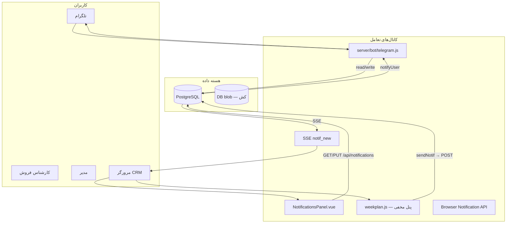
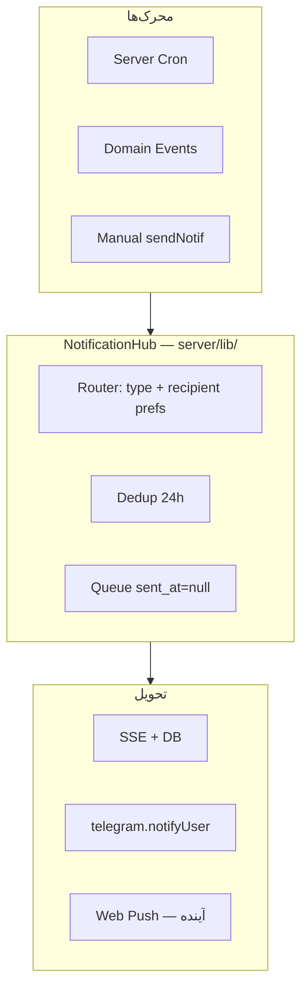

# آنالیز جامع برای پلن ربات تلگرام + پنل نوتیفیکیشن

**پروژه:** Click CRM (Flow)  
**تاریخ:** ۱۴۰۴/۰۴/۲۵ (۱۶ ژوئیه ۲۰۲۶)  
**هدف:** پلن یکپارچه برای ربات تلگرام، تعامل با اپ از طریق ربات، و پنل نوتیفیکیشن اختصاصی هر کاربر

---

## فهرست مطالب

1. [تصویر کلی معماری فعلی](#۱-تصویر-کلی-معماری-فعلی)
2. [وضعیت موجود — ربات تلگرام](#۲-وضعیت-موجود--ربات-تلگرام)
3. [وضعیت موجود — سیستم نوتیفیکیشن](#۳-وضعیت-موجود--سیستم-نوتیفیکیشن)
4. [گزارش‌ها و عملکرد — موجودی داده](#۴-گزارشها-و-عملکرد--موجودی-داده)
5. [شکاف‌ها و ناسازگاری‌ها](#۵-شکافها-و-ناسازگاریها-gap-analysis)
6. [پلن پیشنهادی — فازبندی](#۶-پلن-پیشنهادی--فازبندی)
7. [ماتریس تصمیم](#۷-ماتریس-تصمیم--چه-چیزی-کجا-برود)
8. [اولویت‌بندی اجرا](#۸-اولویتبندی-اجرا)
9. [وابستگی‌های فنی](#۹-وابستگیهای-فنی)
10. [جمع‌بندی](#۱۰-جمعبندی)

---

## ۱. تصویر کلی معماری فعلی



**نکته کلیدی:** ربات تلگرام در این پروژه یک «CRM موبایل» است، نه فقط تأیید پیش‌فاکتور. تقریباً همه عملیات روزانه فروش از طریق ربات قابل انجام است.

---

## ۲. وضعیت موجود — ربات تلگرام

**فایل اصلی:** `server/bot/telegram.js` (~۳۳۸۰ خط)  
**راه‌اندازی:** `server/index.js` — فقط اگر `TELEGRAM_BOT_TOKEN` تنظیم شده باشد  
**Session:** جدول `bot_sessions` (کلید: `chat_id`)

### ۲.۱ قابلیت‌های فعال

| دسته | دستور/منو | عملکرد |
|------|-----------|--------|
| **برنامه روزانه** | `/today`, `☀️ برنامه امروز` | لیست week entries امروز + inline action |
| **برنامه هفته** | `/week`, `📅 برنامه هفته` | نمای هفتگی |
| **مراکز** | `/mycenters`, `/allcenters`, `/search` | لیست، فیلتر، brief قبل تماس |
| **ثبت فعالیت** | `/add`, `/note`, `/followup` | افزودن به برنامه، یادداشت، تغییر فالوآپ |
| **انجام برنامه** | callback `we_done:` | done-modal کامل: نتیجه، یادداشت، اقدام بعدی |
| **وظایف** | `/tasks`, `/task` | لیست + ایجاد + mark done |
| **اعلان‌ها** | `/notifs` | ۱۵ اعلان آخر از SQL |
| **آمار** | `/stats` (کارشناس), `/dashboard`, `/team`, `/overdue`, `/kpi` (مدیر) | گزارش عملکرد |
| **پیش‌فاکتور** | `/proformas` | ارسال/تأیید/رد با inline keyboard |
| **WMS** | `/inventory`, `/scan` (QR) | موجودی و اسکن |
| **پیام مدیر** | `/msg` | ارسال پیام به کارشناس → `notifications` + push |

### ۲.۲ احراز هویت

- **لینکینگ:** لاگین با username/password همان `app_users` (bcrypt)
- **ذخیره session:** جدول `bot_sessions` (کلید: `chat_id`)
- **محدودیت:** بدون OAuth، بدون deep-link token، بدون pre-registration
- **چند دستگاه:** یک کاربر می‌تواند از چند `chat_id` لاگین کند

### ۲.۳ Push خودکار (Scheduler)

| زمان | گیرنده | محتوا |
|------|--------|-------|
| ۰۸:۰۰ روزانه | مدیران | گزارش صبح: برنامه امروز، معوق، پیش‌فاکتور pending |
| ۰۸:۰۰ روزانه | کارشناسان | برنامه شخصی امروز (حداکثر ۵ مورد) |
| ۰۸:۰۰ دوشنبه | مدیران | digest هفتگی KPI |
| ۰۸:۳۰ روزانه | کارشناسان | ⚠️ `sendExpertReminders()` — **تعریف نشده (باگ)** |

### ۲.۴ توابع export ربات

| تابع | کاربرد |
|------|--------|
| `poll()` | شروع long-polling + scheduler |
| `stop()` | توقف polling |
| `notifyUser(username, text)` | push به همه sessionهای یک کاربر |
| `notifyManagers(text)` | push به مدیران |
| `notifyAll(text)` | push به همه sessionهای لاگین‌شده |

### ۲.۵ باگ‌های شناخته‌شده در ربات

1. `sendExpertReminders` فراخوانی می‌شود (خط ~۳۳۴۳) ولی پیاده‌سازی ندارد
2. `_lastReminderDate` بدون تعریف module-level استفاده می‌شود
3. `sendWeeklyDigest` به متغیر `stats` تعریف‌نشده ارجاع می‌دهد (خط ~۳۲۹۹)

### ۲.۶ State machine ربات

```
IDLE, AWAIT_USERNAME, AWAIT_PASSWORD, AWAIT_REJECT, AWAIT_CALL_NOTE,
AWAIT_MSG_TEXT, AWAIT_PLAN_SEARCH, AWAIT_SEARCH_Q, AWAIT_NOTE_SEARCH,
AWAIT_NOTE_TEXT, AWAIT_TASK_TITLE, AWAIT_TASK_DATE, AWAIT_FU_SEARCH,
AWAIT_FU_DATE, AWAIT_OUTCOME_DATE, AWAIT_OUTCOME_NOTE,
AWAIT_STATUS_SEARCH, AWAIT_COMPETITOR_TEXT
```

---

## ۳. وضعیت موجود — سیستم نوتیفیکیشن

### ۳.۱ دو لایه UI (مشکل اصلی)

| لایه | فایل | وضعیت | قابلیت‌ها |
|------|------|-------|-----------|
| **Vue (فعال)** | `src/components/NotificationsPanel.vue` | زنگوله visible | لیست، read-all، کلیک → مرکز |
| **Vanilla (مخفی)** | `public/js/weekplan.js` | `#notifBell` با `display:none` | action buttons کامل، toggle من/همه، ack، ارسال دستی |

**نتیجه:** پنل فعلی که کاربر می‌بیند **ساده‌تر** از آن چیزی است که در کد نوشته شده. اکشن‌های مهم (ثبت تماس، باز کردن وظیفه، تأیید انجام) فقط در کد vanilla هستند ولی UI مخفی است.

### ۳.۲ مدل داده (`notifications` table)

**تعریف:** `server/db.js` (خطوط ~۷۸۷–۸۱۱)

```javascript
{
  id: string,
  to_user: string,
  msg: string,
  center_key: string | null,
  center_keys: string[] | null,  // JSONB
  at: ISO timestamp,
  read: boolean,
  type: string,                  // default 'general'
  meta: object | null,           // JSONB — e.g. { taskId, taskTitle }
  sent_at: timestamp | null      // null = هنوز به تلگرام push نشده
}
```

**انواع (`type`):**

| type | منبع ایجاد | اکشن پیشنهادی |
|------|-----------|---------------|
| `followup` | یادآور معوق، daily monitor | 📞 ثبت تماس / 📋 خلاصه |
| `morning_brief` | briefing صبح (ساعت ۹+) | 📅 برنامه هفته |
| `task` | واگذاری وظیفه | 📋 باز کردن تکلیف |
| `owner_change` | تغییر مالک مرکز | 🔍 مشاهده مرکز |
| `manager_request` | پیام مدیر | 📞 / 📋 / ✓ انجام دادم |
| `ack` | پاسخ کارشناس به مدیر | — |
| `general` | digest، MTR، ... | ✓ انجام دادم |
| `proforma` | ❌ **وجود ندارد** | — |

### ۳.۳ API endpoints

**فایل:** `server/routes/notifications.js`

| Method | Path | توضیح |
|--------|------|-------|
| `GET` | `/api/notifications` | لیست (تا ۲۰۰ مورد). مدیر: همه؛ کارشناس: فقط خودش |
| `GET` | `/api/notifications/count` | تعداد unread |
| `POST` | `/api/notifications` | ایجاد + SSE + Telegram push |
| `PUT` | `/api/notifications/:id/read` | علامت خوانده‌شده |
| `POST` | `/api/notifications/read-all` | همه خوانده‌شده |
| `POST` | `/api/notifications/send-pending` | مدیر: push دستی صف تلگرام |
| `DELETE` | `/api/notifications/:id` | حذف |
| `POST` | `/api/notifications/telegram-push` | فقط تلگرام، بدون ذخیره DB |

### ۳.۴ کانال‌های تحویل

```
ایجاد → POST /api/notifications
         ├─ INSERT notifications
         ├─ SSE broadcast('notif_new')
         ├─ telegram.notifyUser() (اگر autoSend=true)
         └─ Browser Notification API (در تب باز)
```

**تنظیمات (`notifPrefs` در `app_settings`):**

```javascript
{
  enabled: true,
  autoSend: true,   // false → صف (sent_at=null) → مدیر دستی push می‌کند
  types: {
    morning_brief: true,
    followup: true,
    task: true,
    owner_change: true,
    general: true
  }
}
```

**UI تنظیمات:** `public/js/manager.js` (خطوط ~۱۳۱–۱۶۸)  
**ذخیره:** `PUT /api/settings` → `app_settings.notifPrefs`

### ۳.۵ محرک‌های ایجاد اعلان

| محرک | فایل | وابسته به مرورگر باز؟ |
|------|------|----------------------|
| یادآور صبح (۹+) | `public/js/tasks.js` | ✅ فقط اگر **مدیر** لاگین باشد |
| یادآور بعدازظهر (۱۵+) | `public/js/tasks.js` | ✅ همان |
| startup reminder | `init()` در `manager.js` | ✅ همان |
| واگذاری وظیفه | `tasks.js`, `manager-tasks.js` | ❌ فوری |
| تغییر مالک مرکز | `settings.js` | ❌ فوری |
| پیام مدیر | `manager.js` | ❌ فوری |
| MTR معوق | `mtr.js` | ❌ هنگام باز کردن تب |
| HR/Support/Letters | `server/routes/hr.js`, `support.js`, `letters.js` | ❌ بدون SSE |
| پیش‌فاکتور | `server/routes/proforma.js` | ❌ **فقط تلگرام، بدون in-app** |

**نکته حیاتی:** یادآورهای خودکار (صبح/عصر/startup) **client-side** هستند و فقط وقتی مرورگر مدیر باز است اجرا می‌شوند. ربات تلگرام scheduler سرور دارد ولی ناقص است.

### ۳.۶ SSE (real-time)

**Endpoint:** `GET /api/events/stream` — `server/routes/events.js`  
**Handler:** `public/js/core.js` (خطوط ~۹۶–۱۱۸)

```javascript
// وقتی notif_new دریافت می‌شود:
if (data.type === 'notif_new' && data.to === currentUser) {
  _refreshNotifs();
  _firePushNotif('🔔 اعلان جدید', data.msg);
}
```

**Polling fallback:** هر ۶۰ ثانیه (Vue + vanilla)

### ۳.۷ RBAC نوتیفیکیشن

| نقش | GET بدون `?to` | badge | toggle من/همه |
|-----|----------------|-------|---------------|
| کارشناس | فقط خودش | unread خودش | — |
| مدیر | همه (تا ۲۰۰) | unread خودش | vanilla فقط (مخفی) |

---

## ۴. گزارش‌ها و عملکرد — موجودی داده

### ۴.۱ لایه‌های گزارش

```mermaid
flowchart LR
  subgraph client [محاسبه سمت کلاینت — DB blob]
    MGR_PANEL[پنل مدیر — manager.js]
    DRILL[Drill-down]
    OVERDUE[لیست معوق]
    DAILY_MON[گزارش فعالیت امروز — weekplan.js]
    KPI_CALC[calcKPIs — kpi.js]
  end

  subgraph server [API سرور — SQL]
    MR[/api/manager-reports/*]
    RPT[/api/reports/*]
    KPI[/api/kpi-data/*]
    ACT[/api/activity-log]
  end

  subgraph telegram [ربات تلگرام]
    TG_STATS[/stats, /team, /kpi]
    TG_DAILY[sendDailyReport]
  end

  MGR_PANEL --> client
  DRILL --> client
  TG_STATS --> server
  TG_DAILY --> server
```

### ۴.۲ متریک‌های per-user موجود

| حوزه | متریک | منبع | در تلگرام؟ | در پنل نوتیف؟ |
|------|-------|------|-----------|---------------|
| برنامه هفته | planned/done/overdue | `week_entries` | ✅ `/today`, `/week` | ❌ |
| فالوآپ | معوق، امروز، بدون تاریخ | `center_edits` | ✅ `/overdue`, `/suggest` | ✅ `followup` type |
| KPI | ۷ شاخص وزن‌دار + نمره | `calcKPIs` + SQL | ✅ `/stats`, `/kpi` | ❌ |
| فعالیت | تماس/ملاقات/فروش | `call_log`, `visit_log` | ✅ در expert report | ❌ |
| پیش‌فاکتور | pending/approved | `proformas` | ✅ `/proformas` | ❌ (فقط widget مدیر) |
| وظایف | open/done/overdue | `tasks` | ✅ `/tasks` | ✅ `task` type |
| تغییرات فیلد | audit trail | `change_log` | ✅ brief/history | ❌ |
| Win/Loss | دلایل باخت | `center_edits` | ✅ در dashboard | ❌ |
| Payroll | پورسانت/KPI bonus | `payroll_records` | ❌ | ❌ |

### ۴.۳ هفت KPI وزن‌دار (`calcKPIs`)

| ID | متریک | وزن پیش‌فرض |
|----|-------|-------------|
| conversion | قرارداد بسته‌شده | ۲۰٪ |
| retention | نگهداشت مشتری | ۲۰٪ |
| visits | ملاقات/هفته | ۱۵٪ |
| calls | تماس/روز | ۱۵٪ |
| sales | فروش | ۱۵٪ |
| mission | ماموریت | ۵٪ |
| cash | درصد نقدی | ۱۰٪ |

### ۴.۴ تب‌های گزارش تحلیلی (`reports.js`)

| تب | API |
|----|-----|
| فروش | `GET /api/reports/sales-trend` |
| قیف فروش | `GET /api/reports/pipeline` |
| فعالیت‌ها | `GET /api/reports/activity-summary` |
| رقبا | `GET /api/reports/competitor` |
| پوشش استان | `GET /api/reports/coverage` |
| اهداف فروش | payroll APIs |
| حقوق و پورسانت | `GET /api/reports/payroll-history` |
| گزارش کارشناس | چند API ترکیبی |
| پشتیبانی | `GET /api/reports/support-stats` |

### ۴.۵ APIهای بدون UI (فرصت برای ربات/نوتیف)

| Endpoint | توضیح |
|----------|-------|
| `GET /api/manager-reports/daily?date=` | گزارش روزانه per-expert |
| `GET /api/manager-reports/team-summary` | rollup تیم |
| `GET /api/manager-reports/weekly-snapshots` | snapshotهای ذخیره‌شده |
| `GET /api/reports/pipeline-value` | ارزش pipeline |

---

## ۵. شکاف‌ها و ناسازگاری‌ها (Gap Analysis)

### ۵.۱ شکاف‌های معماری

| # | مشکل | تأثیر | اولویت |
|---|------|-------|--------|
| G1 | دو UI نوتیف (Vue ساده vs vanilla کامل) | کاربر اکشن ندارد | 🔴 |
| G2 | یادآورها client-side (نیاز به مرورگر مدیر) | کارشناسان بدون یادآور اگر مدیر offline | 🔴 |
| G3 | `from` در notifications ذخیره نمی‌شود | ack/reply کار نمی‌کند بعد از refresh | 🟠 |
| G4 | پیش‌فاکتور بدون in-app notification | مدیر فقط widget یا تلگرام | 🟠 |
| G5 | HR/Support/Letters بدون SSE | تب باز آپدیت نمی‌شود | 🟠 |
| G6 | ربات scheduler ناقص (`sendExpertReminders`) | یادآور ۸:۳۰ کار نمی‌کند | 🔴 |
| G7 | گزارش‌ها dual-write (blob + SQL) | ناسازگاری احتمالی | 🟡 |
| G8 | لینکینگ تلگرام = لاگین دستی | onboarding سخت | 🟡 |
| G9 | تنظیمات per-user نوتیف وجود ندارد | همه یک `notifPrefs` global | 🟠 |
| G10 | Vue panel برای مدیر همه را نشان می‌دهد بدون toggle | UX مدیر ضعیف | 🟡 |

### ۵.۲ نقشه همپوشانی فعلی

| قابلیت | وب CRM | تلگرام | Push |
|--------|--------|--------|------|
| برنامه امروز | ✅ | ✅ | ✅ (صبح) |
| ثبت تماس سریع | ✅ | ✅ | ❌ |
| وظایف | ✅ | ✅ | ✅ |
| پیش‌فاکتور | ✅ | ✅ | ✅ (فقط TG) |
| یادآور معوق | ✅ | ❌ | ⚠️ (وابسته مرورگر) |
| KPI هفتگی | ✅ | ✅ | ✅ (دوشنبه) |
| گزارش تیم | ✅ | ✅ | ✅ (صبح) |
| اعلان in-app | ⚠️ | ✅ | — |
| اکشن از اعلان | ❌ (Vue) | ❌ | — |

### ۵.۳ Tech debt مرتبط

1. `public/js/activity.js` بارگذاری نمی‌شود (daily monitor غنی‌تر در آن است)
2. Changelog display فقط از blob می‌خواند، SQL فقط POST می‌شود
3. `DB.notifications` blob هنوز fallback در `sendNotif` وجود دارد
4. `telegramNotify` در Settings UI فعال (`settings.js`) نیست — فقط legacy

---

## ۶. پلن پیشنهادی — فازبندی

### فاز ۰: تثبیت پایه

**هدف:** یک کانال واحد نوتیف + scheduler سرور قابل اعتماد

| # | کار | فایل‌های مرتبط |
|---|-----|----------------|
| ۰.۱ | رفع باگ scheduler ربات | `server/bot/telegram.js` |
| ۰.۲ | انتقال یادآورهای client به server cron | `server/lib/notification-scheduler.js` (جدید), `public/js/tasks.js` |
| ۰.۳ | ستون `from_user` در notifications | `server/db.js`, `server/routes/notifications.js` |
| ۰.۴ | Vue panel: action buttons + type/meta | `src/components/NotificationsPanel.vue` |
| ۰.۵ | `type: 'proforma'` در workflow | `server/routes/proforma.js`, `server/routes/notifications.js` |

### فاز ۱: پنل نوتیفیکیشن per-user

**هدف:** inbox عملیاتی برای هر کاربر

#### ۱.۱ مدل داده گسترش‌یافته

```sql
ALTER TABLE notifications ADD COLUMN IF NOT EXISTS from_user TEXT;
ALTER TABLE notifications ADD COLUMN IF NOT EXISTS priority SMALLINT DEFAULT 2;
ALTER TABLE notifications ADD COLUMN IF NOT EXISTS expires_at TIMESTAMPTZ;
ALTER TABLE notifications ADD COLUMN IF NOT EXISTS action_taken TEXT;

CREATE TABLE IF NOT EXISTS user_notif_prefs (
  username TEXT PRIMARY KEY,
  enabled BOOLEAN DEFAULT TRUE,
  channels JSONB DEFAULT '{"web":true,"telegram":true,"browser":true}',
  types JSONB DEFAULT '{}',
  quiet_hours JSONB,
  digest_mode TEXT DEFAULT 'instant'
);
```

#### ۱.۲ UI پنل پیشنهادی

```
┌─────────────────────────────────────────┐
│ 🔔 اعلان‌های من          [همه خوانده] │
├─────────────────────────────────────────┤
│ فیلتر: [همه] [معوق] [وظایف] [پیش‌فاکتور]│
├─────────────────────────────────────────┤
│ ⚠️ ۳ مرکز معوق — امروز پیگیری کنید     │
│   📞 ثبت تماس  📋 خلاصه  ✓ انجام دادم  │
├─────────────────────────────────────────┤
│ 📌 وظیفه «تماس با دکتر X» واگذار شد     │
│   📋 باز کردن وظیفه                     │
├─────────────────────────────────────────┤
│ 📄 پیش‌فاکتور PF-1404-0042 منتظر تأیید │
│   ✅ تأیید  ❌ رد  👁 مشاهده            │  ← فقط مدیر
└─────────────────────────────────────────┘
```

#### ۱.۳ قابلیت‌های per-user

| قابلیت | کارشناس | مدیر |
|--------|---------|------|
| inbox شخصی | ✅ | ✅ (+ toggle «همه») |
| فیلتر بر اساس type | ✅ | ✅ |
| action buttons contextual | ✅ | ✅ (محدود در view همه) |
| ack → reply به فرستنده | ✅ | ✅ |
| تنظیمات شخصی کانال | ✅ | ✅ |
| badge unread | ✅ | ✅ (فقط خودش) |

#### ۱.۴ API جدید پیشنهادی

```
GET  /api/notifications/inbox          — inbox شخصی + فیلتر
GET  /api/notifications/prefs          — تنظیمات شخصی
PUT  /api/notifications/prefs          — ذخیره تنظیمات
POST /api/notifications/:id/action     — { action: 'call'|'task'|'ack'|'brief' }
GET  /api/notifications/digest         — خلاصه روزانه
```

### فاز ۲: تقویت ربات تلگرام

**هدف:** ربات = کانال اصلی موبایل

#### ۲.۱ Onboarding با link token

```
/start → «کد یکبارمصرف از تنظیمات اپ بگیرید»
Settings → «اتصال تلگرام» → کد ۶ رقمی
/link ABC123 → session بدون password
```

```sql
CREATE TABLE telegram_link_tokens (
  username TEXT NOT NULL,
  token TEXT PRIMARY KEY,
  expires_at TIMESTAMPTZ NOT NULL,
  used_at TIMESTAMPTZ
);
```

#### ۲.۲ Inline actions روی push

| type | Inline keyboard |
|------|----------------|
| `followup` | [📞 ثبت تماس] [📋 خلاصه] [✓ انجام شد] |
| `task` | [📋 باز کردن] [✅ انجام شد] |
| `proforma` | [✅ تأیید] [❌ رد] [👁 جزئیات] |
| `morning_brief` | [☀️ برنامه امروز] |

**الگوی callback:** `notif_action:{notifId}:{action}`

#### ۲.۳ دستورات جدید

| دستور | کاربرد |
|-------|--------|
| `/digest` | خلاصه عملکرد امروز/هفته |
| `/snooze 3d` | به‌تعویق انداختن فالوآپ |
| `/call [مرکز]` | ثبت تماس سریع |
| `/brief [مرکز]` | خلاصه قبل تماس |
| `/pipeline` | وضعیت pipeline شخصی |
| `/settings` | تنظیمات نوتیف شخصی |
| `/link` / `/unlink` | اتصال/قطع حساب |

#### ۲.۴ همگام‌سازی read-state

```
تلگرام action/read → SQL update → SSE notif_updated → وب badge آپدیت
وب read/action → SQL update → (اختیاری) edit پیام تلگرام
```

### فاز ۳: Notification Hub یکپارچه



**Domain Events پیشنهادی:**

```javascript
// server/lib/notification-events.js
emit('followup.overdue', { username, centers[] });
emit('task.assigned', { to, taskId, title, centerKey });
emit('proforma.sent', { id, createdBy, total });
emit('weekentry.done', { username, centerKey, result });
emit('kpi.weekly', { username, score, grade });
```

### فاز ۴: گزارش عملکرد در نوتیف + ربات

| نوع digest | زمان | کانال | محتوا |
|------------|------|-------|-------|
| **صبح شخصی** | ۰۸:۰۰ | TG + in-app | برنامه امروز + معوق + وظایف |
| **عصر پیگیری** | ۱۵:۰۰ | TG + in-app | انجام‌نشده‌های امروز |
| **هفتگی KPI** | دوشنبه ۰۸:۰۰ | TG + in-app | نمره KPI + مقایسه هفته قبل |
| **ماهانه** | روز ۱ | in-app | خلاصه فروش + پورسانت |
| **مدیر — تیم** | ۰۸:۰۰ | TG + in-app | rollup تیم + معوق per-expert |

**پیاده‌سازی:** extract منطق `sendDailyReport` + `calcKPIs` → `server/lib/digest-builder.js`

---

## ۷. ماتریس تصمیم — چه چیزی کجا برود؟

| رویداد | In-app | Telegram push | Action در پنل | Action در TG |
|--------|--------|---------------|---------------|--------------|
| معوق جدید | ✅ | ✅ | 📞 ثبت تماس | 📞 ثبت تماس |
| وظیفه واگذاری | ✅ | ✅ | 📋 باز کردن | ✅ انجام شد |
| پیش‌فاکتور sent | ✅ (جدید) | ✅ | ✅/❌ تأیید | ✅/❌ تأیید |
| تغییر مالک | ✅ | ✅ | 🔍 مرکز | 🔍 مرکز |
| پیام مدیر | ✅ | ✅ | ✓ انجام دادم | ✓ انجام دادم |
| briefing صبح | ✅ | ✅ | 📅 برنامه | ☀️ امروز |
| KPI هفتگی | ✅ (جدید) | ✅ | 📈 جزئیات | /stats |
| HR/Support | ✅ | ⚙️ اختیاری | 🔗 لینک | 🔗 لینک |
| MTR معوق | ✅ | ✅ | 🔍 مطالبات | — |

---

## ۸. اولویت‌بندی اجرا

### مرحله ۱ — Foundation

- [ ] رفع باگ scheduler ربات (`sendExpertReminders`, `_lastReminderDate`, `stats`)
- [ ] ستون `from_user` + type `proforma`
- [ ] server cron برای یادآورها (جایگزین client-side در `tasks.js`)
- [ ] Vue panel: action buttons + type/meta از vanilla

### مرحله ۲ — Per-user Panel

- [ ] جدول `user_notif_prefs` + API
- [ ] فیلتر inbox + تنظیمات شخصی در Settings
- [ ] `POST /api/notifications/:id/action`
- [ ] همگام‌سازی read-state TG ↔ web

### مرحله ۳ — Telegram UX

- [ ] `/link` token onboarding
- [ ] inline keyboards روی همه pushها
- [ ] `/digest`, `/snooze`, `/settings`
- [ ] `notif_action` callbacks

### مرحله ۴ — Hub + Reports

- [ ] `NotificationHub` مرکزی (`server/lib/notification-hub.js`)
- [ ] `digest-builder` (صبح/عصر/هفتگی)
- [ ] proforma in-app notification
- [ ] Web Push (اختیاری — `public/sw.js` موجود است)

---

## ۹. وابستگی‌های فنی

| جزء | فایل‌های کلیدی | نوع تغییر |
|-----|---------------|-----------|
| پنل Vue | `src/components/NotificationsPanel.vue` | بازنویسی با actions |
| منطق نوتیف | `public/js/weekplan.js` (`sendNotif`) | extract به shared module |
| API | `server/routes/notifications.js` | prefs + action endpoint |
| ربات | `server/bot/telegram.js` | fix scheduler + inline actions |
| Cron | `server/lib/notification-scheduler.js` | **جدید** |
| Hub | `server/lib/notification-hub.js` | **جدید** |
| Schema | `server/db.js` | migrations |
| Settings UI | `public/js/settings.js` | بخش «اعلان‌ها و تلگرام» |
| SSE | `server/routes/events.js` | event types بیشتر (`notif_updated`) |
| Env | `.env` | `TELEGRAM_BOT_TOKEN` (الزامی برای ربات) |

### متغیرهای محیطی

| Variable | کاربرد |
|----------|--------|
| `TELEGRAM_BOT_TOKEN` | راه‌اندازی ربات — بدون آن ربات غیرفعال است |

### تنظیمات DB (`app_settings`)

| Key | کاربرد |
|-----|--------|
| `notifPrefs` | کنترل global نوتیف + autoSend |
| `telegramNotify` | push پیش‌فاکتور (پیش‌فرض: فعال) |

---

## ۱۰. جمع‌بندی

### آنچه **دارید** (قوی)

- ربات تلگرام بسیار کامل (~۳۳۸۰ خط) با CRUD واقعی CRM
- جدول `notifications` SQL-backed با SSE
- گزارش‌های غنی (manager panel, KPI, reports API)
- Push صبحگاهی و هفتگی از سرور
- done-modal ساختاریافته در ربات (نتیجه/یادداشت/اقدام بعدی)
- پیش‌فاکتور workflow کامل در ربات

### آنچه **ندارید** (برای پلن شما)

- پنل نوتیف **عملیاتی** per-user (Vue فعلی passive است)
- یادآورهای **سرور-محور** (وابسته به مرورگر مدیر)
- تنظیمات نوتیف **per-user** (فقط global `notifPrefs`)
- **همگام‌سازی** read/action بین وب و تلگرام
- نوتیف in-app برای **پیش‌فاکتور**
- onboarding آسان تلگرام (link token)
- `from_user` در DB برای ack/reply

### توصیه استراتژیک

> **ربات تلگرام را به‌عنوان «کانال اجرا»** و **پنل وب را به‌عنوان «کانال مدیریت و تاریخچه»** طراحی کنید — نه دو سیستم جدا. هر دو باید از یک `NotificationHub` تغذیه شوند و جدول `notifications` منبع حقیقت واحد inbox باشد.

### اصل طراحی

```
رویداد CRM → NotificationHub → [فیلتر prefs] → [dedup] → DB + SSE + Telegram
                                                              ↓
                                                    Action از وب یا TG
                                                              ↓
                                                    همان mutation CRM
```

---

## پیوست: نقشه فایل‌های مرتبط

```
server/
  bot/telegram.js              ← ربات کامل
  routes/notifications.js      ← API نوتیف
  routes/events.js             ← SSE
  routes/proforma.js           ← push پیش‌فاکتور
  routes/manager-reports.js    ← گزارش expert/team
  routes/reports.js            ← گزارش‌های تحلیلی
  routes/kpi-data.js           ← اهداف و history KPI
  db.js                        ← schema notifications, bot_sessions

public/js/
  weekplan.js                  ← sendNotif, پنل vanilla (مخفی)
  tasks.js                     ← یادآورهای client-side
  manager.js                   ← notifPrefs UI, گزارش مدیر
  core.js                      ← SSE handler
  reports.js                   ← تب گزارش‌ها
  kpi.js                       ← calcKPIs

src/
  components/NotificationsPanel.vue  ← پنل Vue (فعال)
```

---

*این سند بر اساس آنالیز کدبیس Click CRM در branch `cursor/curser-edition-bd8e` تهیه شده است.*
