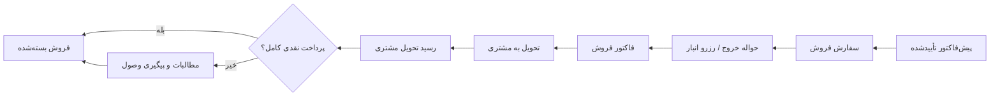

# طرح اجرایی چرخه سفارش فروش، انبار، فاکتور و مطالبات

**وضعیت:** پیشنهادی برای تصویب پیش از پیاده‌سازی  
**دامنه:** Click CRM / WMS  
**اصل قطعی کسب‌وکار:** کالا فقط پس از صدور فاکتور به مشتری تحویل می‌شود؛ اما حواله خروج انبار پیش از فاکتور صادر می‌شود.

## 1. تصمیم معماری

مدل نهایی از چهار سند عملیاتی مستقل تشکیل می‌شود:

پیش‌فاکتور سند پیشنهاد قیمت است؛ سفارش فروش تعهد تجاری؛ حواله مجوز و رزرو/خروج انبار؛ فاکتور سند مالی؛ و رسید تحویل، اثبات تحویل فیزیکی است. هیچ‌یک نباید نقش دیگری را به‌طور پنهان بازی کند.

## 2. اهداف فاز 1

1. جلوگیری قطعی از خروج بیش از مقدار سفارش یا فروش دوباره کالای رزرو‌شده.
2. امکان خروج کامل یا جزئی از یک سفارش، با تخصیص FEFO و ثبت lot واقعی.
3. جلوگیری از تحویل قبل از صدور فاکتور معتبر.
4. تبدیل خودکار فروش نسیه به پرونده مطالبات پس از رسید تحویل.
5. داشتن مالک، کارتابل، زمان و audit برای هر اقدام انبار، مالی و وصول.

## 3. خارج از دامنه فاز 1

- دریافت خرید چندمرحله‌ای از یک PO؛ فاز بعدی است.
- اصلاح جزئی فاکتور پس از خروج کالا؛ در فاز 1 فقط ابطال/اصلاح کنترل‌شده.
- یکپارچه‌سازی عملیاتی با سامانه بیرونی حسابداری یا IMED/TTAC؛ فقط فیلدها و audit لازم آماده می‌شوند.
- رزرو خودکار موجودی در لحظه تأیید پیش‌فاکتور؛ رزرو فقط با صدور حواله انجام می‌شود.

## 4. نقش‌ها و مالکیت کار

| رویداد | مالک اصلی | اقدام‌کننده مجاز | نتیجه |
|---|---|---|---|
| تأیید پیش‌فاکتور | مدیر فروش | مدیر فروش | ایجاد سفارش فروش |
| صدور حواله | انبار منتخب | انباردار / مدیر انبار | رزرو یا خروج کالا بر مبنای lot |
| تأیید فاکتور | مالی | مالی / مدیر | فاکتور معتبر برای تحویل |
| تحویل کالا | انبار یا لجستیک | تحویل‌دهنده | ثبت تحویل و مدارک حمل |
| ثبت رسید تحویل | انبار یا لجستیک | تحویل‌دهنده / مدیر انبار | تأیید تحویل فیزیکی |
| وصول | مالی | مسئول وصول / مالی | ثبت پرداخت و بستن مطالبات |

هر صف کار باید یک `owner` یا گروه مسئول، `claimed_by`، `due_at`، `status` و لینک به سند مبدأ داشته باشد. اعلان صرفاً مکمل کارتابل است و جای کار قابل پیگیری را نمی‌گیرد.

## 5. ماشین حالت

### 5.1 پیش‌فاکتور

از چرخه موجود استفاده می‌شود. تنها تغییر: پس از تأیید نهایی مدیر، به‌جای ساخت مستقیم حواله، یک سفارش فروش ایجاد می‌شود. هر پیش‌فاکتور حداکثر یک سفارش فعال دارد.

### 5.2 سفارش فروش

`confirmed → awaiting_dispatch → partial_dispatch | fully_dispatched → invoiced → delivered → closed`

- `confirmed`: مشتری و مدیر فروش تأیید کرده‌اند.
- `awaiting_dispatch`: در صف انبار است.
- `partial_dispatch`: بخشی از اقلام حواله شده‌اند.
- `fully_dispatched`: همه اقلام موردنیاز حواله شده‌اند و مالی می‌تواند فاکتور کامل صادر کند.
- `invoiced`: حداقل یک فاکتور معتبر دارد؛ تحویل فقط از این وضعیت به بعد مجاز است.
- `delivered`: رسید تحویل معتبر ثبت شده است.
- `closed`: پرداخت نقدی کامل یا مطالبات تسویه شده است.

اگر سیاست شرکت اجازه فاکتور برای ارسال جزئی را بدهد، یک سفارش می‌تواند چند فاکتور داشته باشد؛ هر فاکتور فقط به اقلام/مقادیر حواله‌شده متصل است. در غیر این صورت، فاکتور فقط از `fully_dispatched` صادر می‌شود. **تصمیم پیش‌فرض فاز 1: فاکتور برای مقدار حواله‌شده مجاز است، اما هر فاکتور باید مجموعه دقیق ردیف‌های حواله را داشته باشد.**

### 5.3 حواله خروج

`draft → reserved → issued → awaiting_invoice → invoiced → delivered`

- `reserved`: lotها انتخاب و موجودی قابل فروش رزرو شده، اما سند نهایی نشده است.
- `issued`: حواله خروج انبار نهایی است و مقدار از موجودی قابل فروش کسر شده است.
- `awaiting_invoice`: خروج ثبت شده ولی هنوز فاکتور قابل تحویل صادر نشده است.
- `invoiced`: حواله به فاکتور معتبر متصل است؛ اکنون تحویل مجاز می‌شود.
- `delivered`: رسید تحویل مشتری برای آن ثبت شده است.

ابطال فقط تا پیش از تحویل ممکن است. ابطال حواله مقدار را به موجودی قابل فروش برمی‌گرداند و به مالی/فروش اعلان می‌دهد.

### 5.4 فاکتور فروش

`issued → awaiting_delivery → delivered → paid | partially_paid | receivable | overdue`

فاکتور از حواله و ردیف‌های واقعی lot ساخته می‌شود، نه صرفاً از متن JSON پیش‌فاکتور. فاکتور نمی‌تواند مقدار بیشتری از حواله‌های `issued` مرتبط داشته باشد.

### 5.5 رسید تحویل مشتری

`pending → received | disputed`

برای `received`، حداقل تاریخ، نام و سمت تحویل‌گیرنده و یک مدرک (تصویر/PDF رسید امضاشده یا شناسه حمل معتبر) الزامی است. در حالت `disputed`، دلیل و مسئول حل اختلاف الزامی است و مطالبات باز نمی‌شود.

### 5.6 مطالبات

`not_due → open → partial → settled | overdue | disputed`

پرونده مطالبات از لحظه صدور فاکتور ساخته می‌شود ولی تا ثبت رسید تحویل در `not_due` است. پس از رسید تحویل:

- اگر پرداخت نقدی کامل ثبت شده باشد: `settled`.
- اگر پرداخت کامل نشده باشد: `open` با سررسید از شرایط پرداخت فاکتور.
- پرداخت‌های بعدی، وضعیت را `partial` یا `settled` می‌کنند.
- پس از سررسید، وضعیت به `overdue` می‌رود و کارتابل وصول/مدیر را فعال می‌کند.

## 6. قواعد تجاری غیرقابل مذاکره

1. هیچ تحویلی بدون فاکتور `issued` و حواله مرتبط `invoiced` ثبت نمی‌شود.
2. مجموع مقدار حواله‌شده برای هر ردیف سفارش از مقدار تأییدشده آن بیشتر نمی‌شود.
3. مجموع مقدار فاکتور برای هر ردیف حواله از مقدار حواله‌شده بیشتر نمی‌شود.
4. مقدار lot هرگز منفی نمی‌شود.
5. رزرو و کسر موجودی فقط در تراکنش دیتابیس کوتاه‌مدت انجام می‌شود.
6. انتخاب پیش‌فرض lot بر اساس FEFO و در محدوده انبار انتخاب‌شده است.
7. انتخاب غیر-FEFO فقط با دلیل اجباری و ثبت audit مجاز است.
8. کالای منقضی به‌طور پیش‌فرض قابل تخصیص نیست؛ override نیازمند مجوز ویژه و دلیل است.
9. هر عملیات حساس باید idempotent باشد؛ تکرار درخواست نباید حواله، فاکتور یا پرداخت مضاعف بسازد.
10. حذف مستقیم اسناد نهایی ممنوع است؛ عملیات اصلاحی باید با ابطال/برگشت و audit انجام شود.

## 7. مدل داده پیشنهادی

### 7.1 پیش‌نیاز: نرمال‌سازی ردیف فاکتور

جدول فعلی `invoices.items` از نوع JSONB است. پیش از پیاده‌سازی triad باید `invoice_items` ایجاد شود:

`invoice_items(id, invoice_id, product_id, description, qty, unit_price, discount, tax, total, source_order_line_id)`

JSONB قدیمی تا پایان migration فقط برای سازگاری خواندن باقی می‌ماند؛ منبع حقیقت جدید `invoice_items` است.

### 7.2 سفارش فروش

`sales_orders(id, order_no, proforma_id, center_key, customer_id, warehouse_id, status, payment_terms, sales_owner, created_at, approved_at, ...)`

`sales_order_items(id, sales_order_id, product_id, qty_ordered, qty_dispatched, qty_invoiced, qty_delivered, unit_price, ...)`

### 7.3 اتصال ردیف فاکتور به حواله و lot

`invoice_line_dispatches(id, invoice_id, invoice_item_id, sales_order_item_id, wms_transaction_id, lot_id, qty, lot_no_snapshot, expiry_snapshot, fefo_violation, fefo_violation_reason, dispatched_at)`

این جدول منبع حقیقت مقدارهای حواله‌شده و فاکتور‌شده است؛ نقشه JSONB برای این مسئله مجاز نیست.

### 7.4 WMS

جدول فعلی WMS باید مفاهیم را جدا نگه دارد:

- `direction`: `entry | exit`
- `transaction_kind`: `sales_dispatch | purchase_receipt | sales_return | purchase_return | transfer`
- `status`: `reserved | issued | cancelled | delivered | pending_restock | confirmed_restock | rejected_restock`

فیلدهای لازم: `sales_order_id`, `invoice_id`, `proforma_id`, `warehouse_id`, `product_id`, `lot_id`, `qty`, `idempotency_key`, `issued_by`, `delivered_by`.

در `wms_lots`، نام‌های فعلی پروژه (`product_id`, `qty`, `expiry`) حفظ می‌شوند؛ migration نباید بدون نیاز آن‌ها را به نام‌های حسابیکس تغییر دهد. ایندکس عملیاتی لازم: `(warehouse_id, product_id, expiry)` با فیلتر مقدار مثبت.

### 7.5 رسید تحویل و مطالبات

`delivery_receipts(id, invoice_id, dispatch_id, status, delivered_at, receiver_name, receiver_role, carrier, tracking_no, attachment_id, dispute_reason, recorded_by)`

`receivables(id, invoice_id UNIQUE, customer_id, total_amount, paid_amount, outstanding_amount, due_date, status, owner, opened_at, settled_at)`

پرداخت‌ها با `invoice_payments` موجود حفظ می‌شوند؛ `receivables` وضعیت عملیاتی و مسئول پیگیری را نگه می‌دارد.

## 8. تخصیص FEFO و همزمانی

### پیش‌نمایش

انباردار پیش‌نمایش allocation را بدون قفل می‌بیند: lotهای همان انبار و کالا، با تاریخ انقضا صعودی و مقدار مثبت. پیش‌نمایش فقط پیشنهادی است.

### ثبت نهایی

در Commit، در یک تراکنش کوتاه:

1. ردیف سفارش و lotهای همان انبار/کالا با `FOR UPDATE` خوانده می‌شوند.
2. مقدار سفارش و موجودی دوباره اعتبارسنجی می‌شود.
3. تخصیص FEFO یا override دارای دلیل نهایی می‌شود.
4. `wms_transactions` و `invoice_line_dispatches` ثبت و lotها به‌روز می‌شوند.
5. وضعیت سفارش و کارتابل‌ها به‌روز می‌شوند.

`FOR UPDATE` بدون `SKIP LOCKED` انتخاب می‌شود تا FEFO نقض نشود؛ اما `lock_timeout` محدود دارد. در timeout یا تغییر snapshot، پاسخ `409/423` با allocation جدید داده می‌شود.

## 9. فرآیندهای اصلی

### فروش کامل یا جزئی

1. مدیر فروش پیش‌فاکتور را تأیید می‌کند.
2. سیستم سفارش فروش و کار «صدور حواله» برای انبار ایجاد می‌کند.
3. انباردار preview را بررسی و حواله را ثبت می‌کند.
4. سیستم موجودی را رزرو/کسر و کار «صدور فاکتور» را برای مالی ایجاد می‌کند.
5. مالی فاکتور را فقط از مقادیر حواله‌شده صادر می‌کند.
6. سیستم کار «تحویل و دریافت رسید» را برای انبار/لجستیک ایجاد می‌کند.
7. تحویل‌دهنده رسید تحویل را بارگذاری می‌کند.
8. سیستم پرداخت‌ها را کنترل می‌کند؛ نقدی کامل فروش را می‌بندد، وگرنه مطالبات را برای مسئول وصول فعال می‌کند.

### لغو پیش از تحویل

- پیش از حواله: سفارش لغو می‌شود؛ پیش‌فاکتور در صورت نیاز به `approved` برمی‌گردد.
- پس از حواله و پیش از فاکتور: حواله ابطال و موجودی آزاد می‌شود.
- پس از فاکتور و پیش از تحویل: فاکتور با سند اصلاحی/ابطالی، سپس حواله ابطال می‌شود. اگر پرداخت ثبت شده باشد، ابتدا استرداد یا بستانکار مالی باید ثبت شود.

### مرجوعی پس از تحویل

1. مدیر فروش درخواست مرجوعی را با دلیل و مدرک حمل ثبت می‌کند.
2. کالای برگشتی وارد وضعیت قرنطینه می‌شود، نه موجودی قابل فروش.
3. انباردار یا QC وضعیت فیزیکی، lot، IRC/TTAC و قابلیت فروش را تأیید یا رد می‌کند.
4. تأیید: ورود برگشتی ثبت، سپس اعتبار/ابطال مالی طبق سیاست مالی انجام می‌شود.
5. رد: پرونده اختلاف برای مالی و مدیر فروش ساخته می‌شود؛ فاکتور تا تصمیم نهایی قفل است.

## 10. مجوزها

- فروش فقط سفارش خودش را می‌سازد و مشاهده می‌کند.
- مدیر فروش پیش‌فاکتور/سفارش را تأیید یا لغو می‌کند.
- انباردار فقط برای انبارهای مجاز حواله، تخصیص، تحویل و رسید ثبت می‌کند.
- مالی فاکتور، شرایط پرداخت و پرداخت‌ها را ثبت می‌کند.
- مسئول وصول فقط مطالبات واگذارشده و پرداخت‌ها را مدیریت می‌کند.
- مدیر/سوپرادمین گزارش کامل، رفع اختلاف و عملیات اصلاحی را انجام می‌دهد.

تمام کنترل‌های حساس باید در backend enforce شوند؛ کنترل UI کافی نیست.

## 11. Audit و شماره‌گذاری

برای هر رویداد حساس—تخصیص، override FEFO، صدور/ابطال حواله، صدور/ابطال فاکتور، تحویل، ثبت رسید، پرداخت، مرجوعی و رفع اختلاف—یک رخداد در audit مرکزی و یک ارجاع در WMS ثبت می‌شود.

شماره‌های مستقل و غیرقابل تغییر:

- سفارش فروش: `SO-YYYY-NNNN`
- حواله خروج: `HV-YYYY-NNNN`
- فاکتور فروش: `INV-YYYY-NNNN`
- رسید تحویل: `POD-YYYY-NNNN`
- رسید ورود انبار: `RV-YYYY-NNNN`

شماره‌ها در transaction و با sequence ایمن تولید می‌شوند؛ reset دستی خارج از فاز 1 است.

## 12. APIهای فاز 1

### سفارش فروش

- `POST /api/sales-orders/from-proforma/:id`
- `GET /api/sales-orders/:id`
- `GET /api/sales-orders?status=...`
- `POST /api/sales-orders/:id/cancel`

### انبار

- `GET /api/wms/dispatch-preview/:salesOrderId`
- `POST /api/wms/dispatch-from-order/:salesOrderId`
- `POST /api/wms/dispatches/:id/cancel`
- `GET /api/wms/dispatches?status=awaiting_invoice`

### مالی و تحویل

- `POST /api/invoices/from-dispatches`
- `GET /api/invoices/:id/fulfillment-status`
- `POST /api/delivery-receipts`
- `POST /api/invoices/:id/cancel`

### مطالبات

- `GET /api/receivables?status=open|overdue`
- `POST /api/receivables/:invoiceId/open`
- `POST /api/invoices/:id/payment`
- `POST /api/receivables/:id/assign`

تمام POSTهای مالی/انبار باید `idempotency_key` بپذیرند.

## 13. UI و کارتابل

- فروش: وضعیت سفارش، مقدار حواله‌شده، فاکتور و مطالبات را کنار پیش‌فاکتور می‌بیند.
- انبار: صف «در انتظار حواله»، «در انتظار فاکتور» و «در انتظار تحویل/رسید» دارد.
- مالی: صف «حواله‌شده و آماده فاکتور» و «پرداخت‌های نیازمند ثبت» دارد.
- وصول: صف «مطالبات باز»، «سررسید امروز» و «معوق» دارد.
- هر کارت، مالک، زمان، مبلغ، مرکز، شماره سند، وضعیت و اقدام مجاز را نمایش می‌دهد.

## 14. برنامه اجرا

### فاز A — زیرساخت داده و سازگاری

1. ساخت `sales_orders`، `sales_order_items` و `invoice_items`.
2. migration کنترل‌شده از JSONB فاکتور به `invoice_items` و گزارش تطبیق.
3. افزودن FKها، ایندکس‌های lot و idempotency keys.
4. افزودن audit مشترک.

### فاز B — سفارش و حواله

1. ساخت سفارش از پیش‌فاکتور تأییدشده.
2. FEFO preview/commit و حواله کامل/جزئی.
3. صف انبار و کنترل رزرو/ابطال.

### فاز C — فاکتور، تحویل و رسید

1. ساخت فاکتور فقط از حواله‌ها.
2. قفل تحویل تا صدور فاکتور.
3. بارگذاری و تأیید رسید تحویل.

### فاز D — مطالبات و مرجوعی

1. فعال‌سازی خودکار مطالبات پس از رسید تحویل.
2. پرداخت جزئی/کامل، سررسید و اعلان‌ها.
3. مرجوعی، قرنطینه، QC و مسیر اختلاف.

## 15. معیارهای پذیرش

- [ ] تأیید پیش‌فاکتور دقیقاً یک سفارش فعال می‌سازد.
- [ ] دو درخواست همزمان برای یک lot نمی‌توانند موجودی منفی بسازند.
- [ ] صدور حواله، مقدار بیش از ردیف سفارش را رد می‌کند.
- [ ] خروج جزئی، باقیمانده صحیح سفارش را نمایش می‌دهد.
- [ ] فاکتور فقط از مقدار حواله‌شده ساخته می‌شود.
- [ ] ثبت تحویل بدون فاکتور و حواله مرتبط رد می‌شود.
- [ ] بدون رسید تحویل، مطالبات `open` نمی‌شود.
- [ ] پرداخت کامل، فروش و مطالبات را می‌بندد؛ پرداخت جزئی، مانده صحیح می‌سازد.
- [ ] لغو حواله پیش از تحویل موجودی را بازمی‌گرداند.
- [ ] مرجوعی پس از تحویل بدون QC وارد موجودی قابل فروش نمی‌شود.
- [ ] هر عملیات حساس دارای audit، کاربر، زمان و لینک سندهای مرتبط است.
- [ ] تکرار یک درخواست با idempotency key یک سند جدید نمی‌سازد.

## 16. تصمیم‌های تثبیت‌شده

1. ترتیب قطعی: سفارش فروش → حواله خروج → فاکتور → تحویل → رسید تحویل → نقدی/مطالبات.
2. تحویل پیش از فاکتور ممنوع است.
3. مطالبات پس از رسید تحویل و در نبود پرداخت نقدی کامل فعال می‌شود.
4. حواله می‌تواند پیش از فاکتور صادر شود اما تا اتصال به فاکتور، تحویل‌پذیر نیست.
5. موجودی بر اساس lot، انبار و گردش واقعی WMS کنترل می‌شود؛ نه بر اساس JSONB پیش‌فاکتور یا فاکتور.
